```mermaid
classDiagram
    direction TB

    %% ============================================
    %% NÚCLEO 1: FUNCIONÁRIOS
    %% ============================================

    class Funcionario {
        <<abstract>>
        - String matricula
        - String nome
        - String cpf
        - boolean ativo
        - List~RegistroPonto~ registrosPonto
        + Funcionario(String, String, String)
        + adicionarRegistro(RegistroPonto) void
        + getRegistrosPonto() List~RegistroPonto~
        + getMatricula() String
        + getCpf() String
        + setMatricula(String) void
        + getNome() String
        + setNome(String) void
        + isAtivo() boolean
        + getPermissoes() Set~Permissao~
    }

    class Gerente {
        + Gerente(String, String, String)
        + getPermissoes() Set~Permissao~
    }

    class Vendedor {
        + Vendedor(String, String, String)
        + getPermissoes() Set~Permissao~
    }

    class Estoquista {
        - boolean habilitadoEmpilhadeira
        + Estoquista(String, String, String, boolean)
        + podeMovimentarItemPesado() boolean
        + getPermissoes() Set~Permissao~
    }

    class RegistroPonto {
        - String codigo
        - LocalDateTime dataHora
        - TipoRegistro tipo
        - String justificativa
        + RegistroPonto(String, LocalDateTime, TipoRegistro, String)
        + getCodigo() String
        + getDataHora() LocalDateTime
        + getTipo() TipoRegistro
        + getJustificativa() String
        + isBatidaValida() boolean
        + isEntrada() boolean
        + isSaida() boolean
        + isInicioIntervalo() boolean
        + isFimIntervalo() boolean
        + toString() String
    }

    class Permissao {
        <<enumeration>>
        APROVAR_DESCONTO
        CADASTRAR_FUNCIONARIO
        CANCELAR_VENDA
        ALTERAR_ESTOQUE
        VISUALIZAR_RELATORIOS
        REALIZAR_VENDA
        APLICAR_DESCONTO_PADRAO
        CONSULTAR_ESTOQUE
        CADASTRAR_PRODUTO
        APROVAR_PEDIDO
        ATUALIZAR_ESTOQUE
    }

    class TipoRegistro {
        <<enumeration>>
        ENTRADA
        SAIDA
        INTERVALO_INICIO
        INTERVALO_FIM
    }

    Funcionario <|-- Gerente
    Funcionario <|-- Vendedor
    Funcionario <|-- Estoquista
    Funcionario "1" *-- "0..*" RegistroPonto
    RegistroPonto --> TipoRegistro
    Funcionario --> Permissao

    %% ============================================
    %% NÚCLEO 2: ESTOQUE
    %% ============================================

    class ItemEstoque {
        <<abstract>>
        - String codigo
        - String titulo
        - int quantidadeAtual
        - int quantidadeMinima
        - double precoCusto
        - double precoVenda
        - LocalDate dataCadastro
        + getCategoria() String
        + getPrazoDevolucaoDias() int
        + precisaReposicao() boolean
        + getCodigo() String
        + setCodigo(String) void
        + getTitulo() String
        + setTitulo(String) void
        + getQuantidadeAtual() int
        + setQuantidadeAtual(int) void
        + getQuantidadeMinima() int
        + setQuantidadeMinima(int) void
        + getPrecoCusto() double
        + setPrecoCusto(double) void
        + getPrecoVenda() double
        + setPrecoVenda(double) void
        + getDataCadastro() LocalDate
        + setDataCadastro(LocalDate) void
    }

    class Livro {
        - String isbn
        - String autor
        - String editora
        - int edicao
        - String genero
        + getIsbn() String
        + setIsbn(String) void
        + getAutor() String
        + setAutor(String) void
        + getEditora() String
        + setEditora(String) void
        + getEdicao() int
        + setEdicao(int) void
        + getGenero() String
        + setGenero(String) void
        + getCategoria() String
        + getPrazoDevolucaoDias() int
    }

    class Papelaria {
        - String marca
        - boolean materialEscolar
        + getMarca() String
        + setMarca(String) void
        + isMaterialEscolar() boolean
        + setMaterialEscolar(boolean) void
        + getCategoria() String
        + getPrazoDevolucaoDias() int
    }

    class Eletronico {
        - int garantiaMeses
        - String numeroSerie
        + Eletronico()
        + Eletronico(int, String)
        + getGarantiaMeses() int
        + setGarantiaMeses(int) void
        + getNumeroSerie() String
        + setNumeroSerie(String) void
        + getCategoria() String
        + getPrazoDevolucaoDias() int
    }

    ItemEstoque <|-- Livro
    ItemEstoque <|-- Papelaria
    ItemEstoque <|-- Eletronico

    %% ============================================
    %% NÚCLEO 3: VENDAS
    %% ============================================

    class Cliente {
        - String cpf
        - String nome
        - String email
        - LocalDate dataCadastro
        - List~Venda~ historicoCompras
        + Cliente(String, String, String, LocalDate)
        + getCpf() String
        + getNome() String
        + getEmail() String
        + getDataCadastro() LocalDate
        + adicionarVenda(Venda) void
        + getHistoricoCompras() List~Venda~
    }

    class Venda {
        - String codigoVenda
        - LocalDateTime dataVenda
        - double descontoAplicado
        - StatusVenda status
        - Funcionario funcionario
        - Cliente cliente
        - Map~ItemEstoque,Integer~ itensVenda
        - Pagamento pagamento
        + Venda(String, Cliente, Funcionario)
        + adicionarItem(ItemEstoque, int) void
        + calcularTotal() double
        + aplicarDesconto(double) void
        + setPagamento(Pagamento) void
        + finalizar() void
        + getCodigoVenda() String
        + getDataVenda() LocalDateTime
        + getDescontoAplicado() double
        + getStatus() StatusVenda
        + getFuncionario() Funcionario
        + getCliente() Cliente
        + getItensVenda() Map~ItemEstoque,Integer~
        + getPagamento() Pagamento
    }

    class StatusVenda {
        <<enumeration>>
        FINALIZADA
        CANCELADA
        DEVOLVIDA_PARCIAL
        DEVOLVIDA_TOTAL
    }

    class Pagamento {
        <<abstract>>
        - double valorTotal
        - LocalDateTime dataPagamento
        - StatusPagamento status
        + processar(double) void
        + getMetodoPagamento() String
        + getValorTotal() double
        + getDataPagamento() LocalDateTime
        + getStatus() StatusPagamento
    }

    class PagamentoDinheiro {
        - double valorRecebido
        - double troco
        + processar(double) void
        + getMetodoPagamento() String
        + getValorRecebido() double
        + getTroco() double
    }

    class PagamentoPix {
        - String CHAVE_PIX <<static>>
        + PagamentoPix()
        + processar(double) void
        + getMetodoPagamento() String
        + getChavePix() String
    }

    class VendaRepository {
        - static final Path ARQUIVO_VENDAS
        + salvarVenda(Venda) void
        + lerVendas() List~String~
    }

    Cliente "1" o-- "0..*" Venda : historicoCompras
    Venda --> Cliente
    Venda --> Funcionario
    Venda --> Pagamento
    Venda --> ItemEstoque
    Venda --> StatusVenda
    Pagamento <|-- PagamentoDinheiro
    Pagamento <|-- PagamentoPix
    Pagamento --> StatusPagamento
    VendaRepository ..> Venda
```

    class PagamentoPix {
        - String chavePix
        - String codigoTransacao
        + processar(valor) void
        + getMetodoPagamento() String
    }

    class StatusPagamento {
        <<enumeration>>
        PENDENTE
        APROVADO
        RECUSADO
    }

    class Devolucao {
        - LocalDate dataDevolucao
        - String motivo
        - double valorReembolsado
        - Map~ItemEstoque,Integer~ itensDevolvidos
        + processarDevolucao() void
        + getVendaOriginal() Venda
    }

    Venda "1" --> "1" Funcionario : funcionario
    Venda "1" --> "0..1" Cliente : cliente
    Venda "1" --> "1..*" ItemEstoque : itensVenda
    Venda "1" --> "1" Pagamento : pagamento
    Venda --> StatusVenda
    Pagamento <|-- PagamentoDinheiro
    Pagamento <|-- PagamentoCartao
    Pagamento <|-- PagamentoPix
    Pagamento --> StatusPagamento
    Cliente "1" --> "0..*" Venda : historicoCompras
    Cliente "1" --> "0..*" Reserva : reservasAtivas
    Devolucao "1" --> "1" Venda : vendaOriginal
    Devolucao "1" --> "1..*" ItemEstoque : itensDevolvidos
    Devolucao "1" --> "1" Funcionario : funcionario

    %% ============================================
    %% EXCEÇÕES
    %% ============================================

    class EstoqueInsuficienteException {
        + EstoqueInsuficienteException(item, solicitado, disponivel)
    }

    class PermissaoNegadaException {
        + PermissaoNegadaException(funcionario, permissao)
    }

    class PagamentoRecusadoException {
        + PagamentoRecusadoException(motivo)
    }

    class PrazoDevolucaoExpiradoException {
        + PrazoDevolucaoExpiradoException(item, diasPassados)
    }

    class GarantiaExpiradaException {
        + GarantiaExpiradaException(item, mesesPassados)
    }

    class BatidaPontoInvalidaException {
        + BatidaPontoInvalidaException(motivo)
    }

    class FuncionarioInativoException {
        + FuncionarioInativoException(funcionario)
    }

    class CpfDuplicadoException {
        + CpfDuplicadoException(cpf)
    }

    class IsbnInvalidoException {
        + IsbnInvalidoException(isbn)
    }

    class ReservaExpiradaException {
        + ReservaExpiradaException(reserva)
    }

    class DadosInvalidosException {
        + DadosInvalidosException(campo, motivo)
    }

    class EntidadeReferenciadaNaoEncontradaException {
        + EntidadeReferenciadaNaoEncontradaException(entidade, referencia)
    }

    class LinhaCorrompidaException {
        + LinhaCorrompidaException(arquivo, linha)
    }

    %% ============================================
    %% PERSISTÊNCIA
    %% ============================================

    class PersistenciaLivraria {
        - String DIRETORIO
        + carregarTudo() void
        + salvarTudo() void
        - carregarFornecedores() List~Fornecedor~
        - carregarItens(fornecedores) List~ItemEstoque~
        - carregarFuncionarios() List~Funcionario~
        - carregarPontos(funcionarios) List~RegistroPonto~
        - carregarClientes() List~Cliente~
        - carregarVendas(func, clientes, itens) List~Venda~
        - carregarDevolucoes(vendas, itens, func) List~Devolucao~
        - carregarReservas(itens, clientes) List~Reserva~
        - reconectarVinculos() void
        - salvarFuncionarios() void
        - salvarItens() void
        - salvarVendas() void
    }

    PersistenciaLivraria ..> Funcionario
    PersistenciaLivraria ..> ItemEstoque
    PersistenciaLivraria ..> Venda
    PersistenciaLivraria ..> Cliente
    PersistenciaLivraria ..> Fornecedor
    PersistenciaLivraria ..> PedidoReposicao
    PersistenciaLivraria ..> Devolucao
    PersistenciaLivraria ..> Reserva
    PersistenciaLivraria ..> RegistroPonto
    ```
